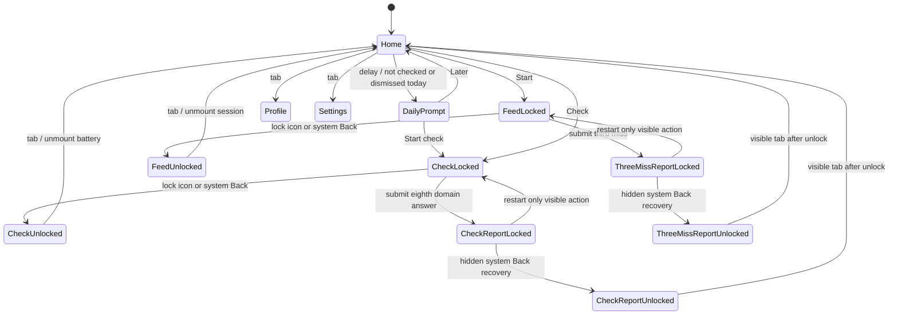
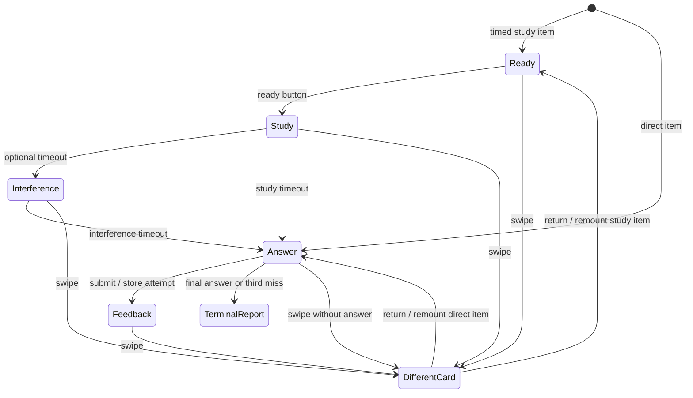
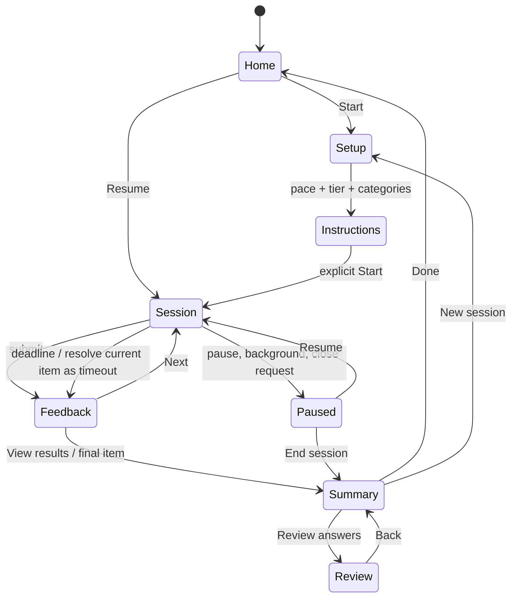

# PuzzleScroll: app content, states, and UX audit

Date: 2026-09-22. Checkout: `2c9d1ce`, `main`. Scope: all five current screens, startup prompt, ready/study/interference/answer/feedback states, assessment and three-misses reports, persistence, navigation, analytics, and all three supplied screenshots. Application code has not been changed.

## Evidence and limits

- **Screenshot evidence:** inspected the two UUID-named JPGs and `WhatsApp Image 2026-09-22 at 12.58.04 AM.jpeg` in the repository root. These show the trail answer, assessment report, and implication answer, respectively. They are ignored local user files, not copied into the audit.
- **Code evidence:** inspected `App.tsx`, all components, types, store, scoring, generators, and PWA assets. Source line references below refer to the audited checkout.
- **Executed evidence:** `npm.cmd run typecheck` and `npm.cmd run validate:puzzles` both passed. `node docs/audit/ux-state-probes.cjs` executed actual TS/TSX component/store functions with mocked hooks, native components, timers, and AsyncStorage. Eleven probes reproduced the listed behaviours. The script does not write user progress or app code.
- **Device-test gap:** browser inventory was empty and an isolated browser could not be created. No claim is made that every screen was exercised on an actual phone/browser. Gesture arbitration, keyboard/screen-reader behaviour, orientation, font scaling, lifecycle suspension, and visual clipping beyond the screenshots require the device acceptance suite in the implementation plan. Source-derived risks are distinguished from demonstrated failures.
- These probes are diagnostic artifacts, not a proposed production test framework. Their hook host does not reproduce React scheduling or native layout.

## The three screenshot reports, precisely

1. **Assessment ending: confirmed defect.** The eighth answer triggers `setComplete(true)` inside `onAnswered` (`App.tsx:347`). The question and feedback disappear immediately. The report (`App.tsx:367`) contains only a restart action; the immersive shell still hides tabs (`App.tsx:710`). The screenshot confirms no visible exit. Android/browser Back may unlock the shell through its separate handler; that is a hidden recovery path, not an acceptable visible exit.
2. **Trail: inadequate communication plus an incomplete rule.** The screenshot's selected `2-B-1-A` does alternate, but violates the code's `Start at A` instruction (`puzzleGenerators.ts:604`). The screenshot has scrolled that part out of view. It would be inaccurate to declare that particular selection correct under the whole current prompt. However, ascending letter/number order is never stated. Longer random options can start at A and alternate without matching the keyed ascending path. The shuffled tokens are an available-item pool, not a sequence to continue, but the UI never explains that distinction. The explanation merely repeats the key.
3. **Implication: correct key, opportunity to teach more clearly.** Given `A → B`, `B → C`, and `¬C`, the only consistent assignment is `¬A ∧ ¬B ∧ ¬C`. If B were true, rule 2 would require C true, contradicting the given fact; if A were true, rule 1 would require B true. Keep the answer. Explain this reasoning in plain language and state that all rules are always true. `¬A` alone would not force `¬B`; that is a different inference. Do not change a correct key to agree with a complaint.

## Current state graph

The second graph exposes the central design fault: visible answer state belongs to an ephemeral card, while attempt deduplication belongs to its parent and durable scores belong to another store. Returning to a card resets the first but not the others. A complete assessment/session entity is missing.

## Screen-by-screen coverage

| Surface/state | What works | What fails or needs redesign |
|---|---|---|
| Home, no data | Clear Start action; access to categories indirectly | Nine metric tiles before meaningful history; zero/50 defaults look like measured results; duplicate Start Training; no simple session setup |
| Home, returning user | Practice totals and last check visible | Rolling attempt cap changes apparent all-time totals; UTC/local date mismatch; streak not recomputed after inactivity; no resume session |
| Daily prompt | Can choose Later | Appears after 500ms before intent; recurs daily; says baseline repeatedly; no estimated duration/task preview; hydration may race first interaction |
| Feed, immersive | Focused central task | Exit hidden behind lock metaphor; item/domain/pace missing; no actual timer; navigation not an explicit decision |
| Feed, non-immersive | Prev/Next available | Header always Daily Mix; quantity is infinite; no skip record or session finish; shell and card compete for vertical space |
| Ready | Study begins on explicit action | Boilerplate repeated each item; no study-duration cue; swipe permits bypass; no session pause/exit contract |
| Study | Timed exposure implemented | Timing invisibly advances; all stream tiles may be simultaneous; no interruption handling; verbal shape labels substitute for visual shapes |
| Interference | Distinct phase exists | Distraction already displays solved arithmetic and accepts no response; prompt asks to solve but interaction cannot verify it |
| Answer | Choices are large | Tap commits immediately, especially risky for long reasoning; prompt can leave viewport; no bookmark/hint/report mechanism; no explicit skip |
| Feedback | Text + icons + colour indicate correctness | Three redundant result treatments; explanation before choices moves content; no original timed stimulus review; no rationale for distractors |
| Revisiting answered item | Parent prevents duplicate saved attempt | Card forgets prior response and offers a new answer, producing unsaved feedback that may disagree with stored result |
| Three-misses completion | Restart works | Third error feedback disappears; no visible exit; judgemental headline; `seen` is current index, not completed work |
| Check, initial/in-progress | One item per domain | No preparation/example screen; no timer; no unanswered checklist; no reliable resume; practice-derived difficulty confounds later comparisons |
| Check, skipped item | Can go back using hidden controls | Can reach last item without completing all domains; no indication which item remains; route to completion is unclear |
| Check, final report | Displays per-domain scores | Final feedback missing; no exit/review; unearned precision from one answer; unsupported separate-task claim; no speed/accuracy breakdown |
| Profile, empty | Eight domain labels exist | Filled radar at 50 and Fitness 50 imply measurement; no useful first-session call to action |
| Profile, populated | Some accuracy and response data exist | Composite conflates task families and difficulty; chart lacks history and counts; no filters, session history, answer review, speed–accuracy context |
| Settings | Granular category/type access | 90 pressables, seven overlapping modes; two hard presets same selection; internal placement copy; silent filter/persistence surprises |
| Reset | Clears local state | Immediate destructive action beside ordinary controls; no confirmation/undo; also resets preferences without clear explanation |
| Background/relaunch | Attempts persisted | Active puzzle/battery lost; timers include inactive time or progress offscreen; hydration/write errors silent |
| Browser/PWA | Install assets and caching exist | UI update can occur mid-session; arbitrary cache deletion/fallback logic needs review; browser history isn't route-aware |

## Findings and proposed changes

Severity: **P0** blocks trustworthy grading or traps an essential flow; **P1** materially impairs use/data integrity; **P2** content/visual polish or an unverified platform risk. A probe ID can cover a coupled family of findings.

| ID | Priority / evidence | Finding and cause | Concrete remedy / success condition |
|---|---|---|---|
| UX-01 | P0 screenshot + probe | Assessment final answer immediately unmounts; report lacks exit. `App.tsx:347–395,710` | Persist last answer, show its feedback, require View results; report has visible Done and Review answers. Exit is independent of immersive state. |
| UX-02 | P0 probe + code | Same defect on third miss. `App.tsx:124–157` | Finish after final feedback acknowledgement; completion offers Review, Done, optional retry. |
| UX-03 | P1 code + screenshot | Lock icon is the only visible escape before completion; system Back is hidden recovery. `App.tsx:175,408,680` | Persistent labelled close/pause action on all active and terminal states. Focus mode must never hide essential navigation. |
| UX-04 | P1 probe | 5/10/20-minute goals are 8/18/32-item batch sizes; more batches append forever. Twenty unanswered Next actions still show feed index 20 and zero attempts. `App.tsx:27–35,97–109` | Explicit session with active-time budget and finite finish rules. Skips recorded. Slow mode permits deliberate finish-current-item after soft target. |
| UX-05 | P1 probe + code | Back to an answered card loses selection; parent discards subsequent attempt while UI shows new outcome. `PuzzleCard.tsx:15–26`, `App.tsx:119,347` | Render card from session-owned response record; review mode is immutable. New retry gets a new attempt identity and cannot change original score. |
| UX-06 | P1 code | Leaving a tab destroys local session/battery; reload cannot resume. `App.tsx:702–708` | Persist resumable session snapshot, immutable item version/seed, answer and phase data; choose Resume or End when navigating away. |
| UX-07 | P1 code, device check pending | Outer PanResponder captures vertical moves and wheel handler prevents default even while a long card needs scrolling. `App.tsx:448–472`, `PuzzleCard.tsx:77` | Use ordinary document scrolling in slow mode. Optional bounded-edge swipe only after feedback in fast mode; explicit Next always exists. |
| UX-08 | P1 screenshot + code | Essential start rule scrolled offscreen; answer feedback expands document; instructions not discoverable at grading. | Stable concise instruction/task header; separate stimulus from required rules; feedback keeps answer and rationale together; full context accessible in review. |
| UX-09 | P1 code | No active-time model, visibility handling, pause, deadline, timeout or interrupted-study status. `PuzzleCard.tsx:18–62` | Record active study/response/feedback time separately; monotonic foreground timing; pause on background; invalidate/restart an interrupted exposure without scoring it. |
| UX-10 | P1 probe | One-second wrong hard answer adds 0.25 min and one Hard solved. `store:183`, `App.tsx:195,266` | Count correct completed items as solved; log real active time and labelled included phases. Do not fabricate historical time. |
| UX-11 | P1 probe | Retained attempts stop at 300, assessments at 50; Profile Puzzles looks lifetime but isn't; date-range totals become incomplete. `store:169,209`, `App.tsx:196–209,278` | Durable session/day aggregates plus bounded detail retention; label partial history; preserve known lifetime aggregates. |
| UX-12 | P1 code | UTC day keys vs local dashboard days; stale streak remains visible after inactivity; no midnight refresh. `App.tsx:34,198`, `store:46,119` | One explicit local practice-day convention with timezone recorded; derive streak at read time, refresh on foreground/day change. |
| UX-13 | P1 probe + formula | Wrong fast answer earns 32/100; unrelated tasks share speed budgets; Fitness rewards hard attempts, even wrong ones. `scoring:16`, `App.tsx:269` | Prioritise accuracy and correct-trial latency; remove unvalidated Fitness score; separate task/pace/difficulty versions. Do not present speed on wrong responses as success. |
| UX-14 | P1 probe | First check is monthly; baseline stays 50. Practice and check overwrite same latest score and difficulty. One answer/domain yields 0/1 accuracy. `App.tsx:356`, `store:163–204` | First eligible completed check becomes baseline; practice/check series separate; minimum sample metadata; partial and interrupted checks explicitly labelled. |
| UX-15 | P1 code | Report says different untrained tasks, but most are shared generators. `App.tsx:372`, `puzzleGenerators.ts:1999` | Remove claim now; build/version independent forms if comparison is retained. Plain copy: This reflects performance on these tasks today. |
| UX-16 | P1 probe + copy audit | 90 settings controls, overlapping presets and developer-oriented placement/source/generation paragraphs. `App.tsx:504–613` | Default Fast/Slow, Easy/Medium/Hard, categories. Custom opens optional fine controls; About/Sources holds relevant provenance. |
| UX-17 | P1 probe | Disabling one of 68 types leaves 67 in memory but serialises all 68 because `rawTypes.length >= 50`. `store:102–116,129` | Versioned explicit migration; preserve exclusions exactly across reload. Separate All from explicit type IDs. |
| UX-18 | P1 probe | Domain/type combination with no intersection silently falls back to disabled puzzle types. `puzzleGenerators.ts:2010–2038` | Show empty selection state with actions to reset filters or change categories; never serve disallowed content. |
| UX-19 | P1 code | Reset invokes deletion immediately and clears preferences too. `App.tsx:610`, `store:242` | Settings → Data → explicit confirmation explaining scope; separate progress reset from preference reset; optional export before delete. |
| UX-20 | P2 code; risk not reproduced | Hydration has no ready/error state; actions can race a delayed read and be replaced. Writes are unsequenced and failures swallowed. `store:142,268` | Gate initial session setup on hydration; versioned validation and serial writes; visible recovery if persistence fails; durable session checkpoints. |
| UX-21 | P2 code + screenshot | No accessibility labels/roles/states on icon-only actions or choices; heavy fonts and tiny feedback copy; no live feedback focus contract. | Accessible control names/states, logical keyboard order, result announcements, scalable text, minimum 44-point primary controls, contrast checks. Validate VoiceOver/TalkBack. |
| UX-22 | P2 screenshot + code | Mostly font weight 800/900, bordered panels nested inside cards, three copies of result, persistent swipe text. | Normal-weight body copy; restrained title/label hierarchy; one status + selected answer + reasoning block; subtle dividers, fewer boxes and onboarding hints. |
| UX-23 | P2 code; device check pending | Fixed min card height plus shell chrome can exceed small viewport; choices and lengthy text compete. `App.tsx:100,336`, styles | Use measured available viewport and safe insets; flexible single-column content; test 320/390/430px width, landscape and 200% text scale. |
| UX-24 | P1 code | User must self-discover task objective; all families forced through single MCQ UI, including streams/inhibition/planning. | Task-specific renderers and instruction examples: visual trial, span input, numeric/text response, ordered steps, case study and MCQ. A solved arithmetic display is not an interactive interference task. |
| UX-25 | P2 code | No review list, explanation history, saved challenges, local issue-report path or mistake practice. | Session review includes original stimulus, answer, solution, misconception, active time; local Report problem can flag/exclude a version pending author QA. No backend assumed. |
| UX-26 | P1 code | Changing levels updates store but current prebuilt batch retains old difficulty; many hard families ignore level; aggregate levels aren't comparable. | Generate at item/block boundary from calibrated eligible pool; adapt inside chosen tier using recent reliable samples. Store delivered difficulty, not just current profile level. |
| UX-27 | P2 code | Daily prompt interrupts discovery; baseline phrasing confuses repeated checks with initial baseline. | Home provides optional Check card, initial setup explains purpose/duration; no automatic modal; use First check vs Progress check consistently. |
| UX-28 | P2 code | User-facing Daily Mix header remains even in other modes; duplicated Home Start actions and statistics; no next-step rationale. | Show actual pace/tier/categories and one main Start/Resume action. Home retains three relevant stats and optional recommended review. |
| UX-29 | P2 code; device check pending | History pushState every lock entrance is not balanced routing; Back behaviour varies by locked state. `App.tsx:680–697` | Navigation state owns Back/close once; finish clears session route; test Back/reload/link entry across web and Android. |
| UX-30 | P2 code | Service worker clears all other caches on origin and returns root HTML for any failed asset request. `public/service-worker.js` | Namespace-owned cache cleanup only; navigation fallback only for navigation; safe update notification between sessions; verify offline assets and interrupted downloads. |

## Copy decisions

| Current text | Decision | Replacement / destination |
|---|---|---|
| Complex puzzle placement / harder CAT/GMAT-style tasks live mainly... | Remove from normal settings | Internal curriculum documentation only |
| Puzzle generation / parameterized generators... | Remove from settings | Technical docs; no user benefit during setup |
| Hard puzzle sources paragraph | Move | About → Sources and per-item Source disclosure, only as required/meaningful |
| These scores use different tasks...reduce practice-test bias | Remove unsupported claim | Your results for this check; then accuracy, time, sample sizes |
| Do a quick baseline? / Short baseline for today | Rewrite | First check / Progress check; display duration and task count before Start |
| Stop while it still counts | Remove | Session complete; neutral summary and review action |
| Cognitive Fitness / Fitness | Remove pending defensible metric | Accuracy, correct-answer response time, consistency; no pretend cognitive measure |
| Hard solved | Fix definition or rename | Correct hard questions; attempted tracked separately |
| Result saved. Swipe when you are ready + floating swipe hint + red/green bar | Consolidate | Next question or View results; a one-time gesture tip only where appropriate |
| I'm ready / Start when you are ready... | Shorten, retain useful timing information | Start study; show e.g. 2-second display, then answer |
| What the app does/doesn't claim | Move and shorten | About, with brief task-performance context where results appear |

## Recommended destination flow

Timers, interrupted exposure, skipping and multi-part case rules must be explicit guards in this state machine. No terminal state depends on the tab bar being visible. A final answer committed before the deadline always receives normal feedback before Summary. An unanswered expired item is labelled Timed out, not silently marked as a submitted wrong answer.

## Implementation priorities

1. Restore answer trust and finish/exit/review paths; quarantine ambiguous/broken questions.
2. Establish session/attempt ownership and honest analytics before adding timers to old state.
3. Replace the crowded configuration with the two requested axes plus categories; preserve Custom.
4. Add multiple trials for quick tasks and substantive slow case studies with independently verified solutions.
5. Refine layout, learning feedback and engagement; complete actual-device acceptance before calling UX verified.

See [the executable plan](../plan.md) for phases, acceptance criteria, migration rules, timer semantics, content targets and release gates. Its required setup is Fast/Slow x Easy/Medium/Hard plus categories; source collections do not replace these controls.
